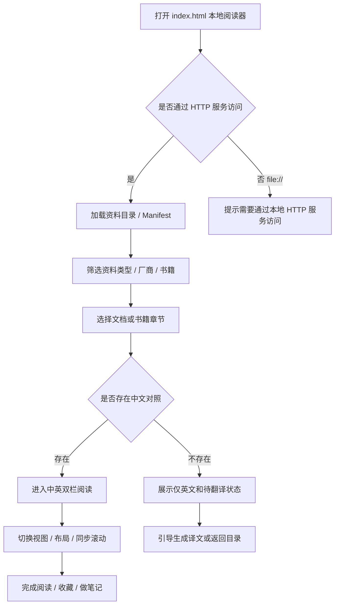
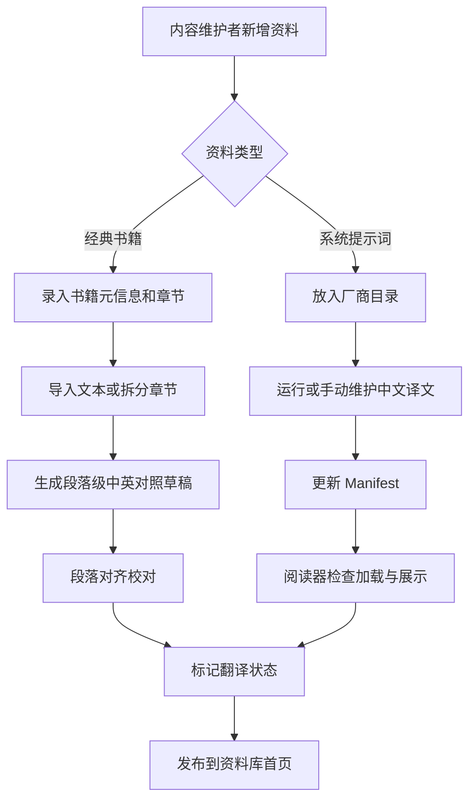
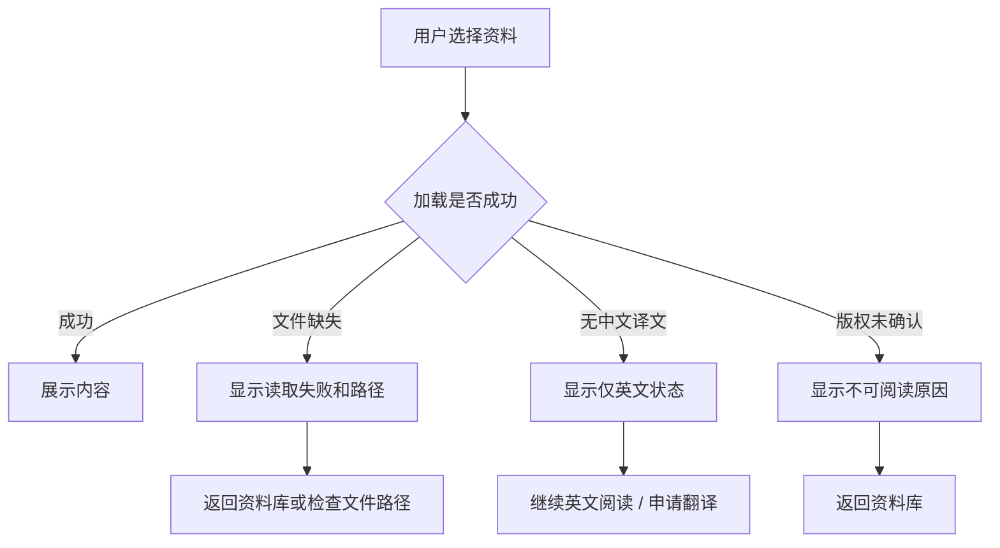

# AI 资料中英对照阅读平台 PRD

> 来源说明：仓库中未发现精确命名的 `需求清单.md`。本文以 `docs/2026-05-15-经典书籍中英对照查看功能清单.md` 作为本次需求清单真源，并结合 `README.md`、`index.html`、`tools/translate_prompts.py` 的现有能力整理和补充。
> 本文定位：面向后续原型生成、开发实现和验收的产品需求文档。

## 1. 产品概述

### 1.1 一句话定位

这是一个给中文 AI 产品、研发、研究和内容学习者使用的 Web 阅读与资料整理工具，帮助他们对照阅读英文 AI 系统提示词、中文译文，以及后续扩展的经典英文书籍和创业资料。

### 1.2 项目当前状态

当前仓库已经具备一个可运行的本地 Web 阅读器：

- 通过 `index.html` 展示厂商目录中的英文原文和 `中文/` 译文。
- 通过 `MANIFEST` 维护厂商、文件、中文对照文件的映射。
- 支持目录筛选、已翻译/待翻译过滤、中文/英文/双栏视图、阅读布局切换、区块级高亮、章节导航和联动滚动。
- 通过 `tools/translate_prompts.py` 批量翻译文本文件，并将译文写入对应厂商目录的 `中文/` 子目录。

### 1.3 【本次补充】整体产品逻辑

项目不应只被定义为“系统提示词中文翻译仓库”，而应升级为“AI 资料中英对照阅读平台”：

```text
内容层
├── AI 系统提示词
│   ├── 厂商目录
│   ├── 英文原文
│   └── 中文译文
└── 经典书籍 / 手册
    ├── 书籍元信息
    ├── 章节
    ├── 英文原文段落
    └── 中文翻译段落

处理层
├── 文件发现 / Manifest 管理
├── 翻译生成
├── 内容清洗
├── 段落或区块对齐
└── 校对状态管理

阅读层
├── 资料库首页
├── 分类 / 搜索 / 筛选
├── 双栏对照阅读器
├── 章节导航
└── 空状态 / 版权与来源说明

沉淀层
├── 收藏
├── 笔记
├── 主题书单
├── 术语卡片
└── AI 摘要与导读
```

### 1.4 产品形态

- **当前选型**：网页 Web App，本地静态站优先。
- **选择理由**：现有仓库已经是 HTML + 本地文件读取结构，资料类型以长文档阅读为主，大屏双栏对照更适合 Web。
- **阶段策略**：第一阶段保持静态站和本地 HTTP 服务；第二阶段再考虑独立数据索引、内容管理、笔记状态持久化；不优先做原生 App。

### 1.5 不做什么

- 不把项目做成泛内容社区。
- 不做版权不清内容的大规模分发。
- 不把 PDF 解析、OCR、机器翻译质量作为第一阶段核心交付。
- 不优先做复杂账号、付费、会员、DRM。
- 不把阅读器改成重型后台系统；管理功能服务于内容录入和校对，不喧宾夺主。

## 2. 目标用户与使用场景

### 2.1 目标用户

| 用户类型 | 典型特征 | 核心诉求 |
|----------|----------|----------|
| AI 产品经理 | 需要理解主流 AI 产品和 Agent 产品的提示词、交互边界、产品设计 | 快速读懂英文资料，提炼可复用产品机制 |
| AI 研发 / Prompt Engineer | 关注系统提示词结构、工具调用、边界控制、安全策略 | 对照原文与译文，避免翻译误解 |
| 内容整理者 / 翻译者 | 负责把英文资料整理成中文版本 | 看清翻译覆盖率、校对段落、发现缺失 |
| 创业者 / 学习者 | 想读 AI 原生创业资料、经典书籍和手册 | 用中英对照降低阅读门槛，并沉淀笔记 |

### 2.2 典型使用场景

1. AI 产品经理想研究 Claude、OpenAI、Cursor 等系统提示词结构，在目录中筛选厂商，进入双栏阅读器，对照英文和中文理解产品行为约束。
2. 翻译者发现某个厂商目录还有待翻译文件，运行脚本生成中文译文，再回到阅读器检查区块是否可读、是否需要人工修正。
3. 创业者想阅读《创始人手册-构建一个AI原生初创公司.pdf》，进入经典书籍模块，查看章节目录，并按段落进行中英对照阅读。
4. 用户在阅读时遇到关键段落，将其收藏或添加笔记，后续可按主题回看。

## 3. 核心用户动线

### 3.1 主阅读动线



### 3.2 内容录入与校对动线



### 3.3 异常分支



## 4. 功能清单

```text
AI 资料中英对照阅读平台
├── 🔴 核心：资料库与导航
│   ├── AI Prompt 厂商目录
│   ├── 经典书籍库
│   ├── 搜索与筛选
│   └── 翻译状态标识
├── 🔴 核心：中英对照阅读器
│   ├── 中文 / 英文 / 双栏视图
│   ├── 布局宽度切换
│   ├── 区块或段落同步滚动
│   ├── 章节导航
│   └── 读取失败 / 无译文空状态
├── 🔴 核心：内容结构与来源说明
│   ├── 文件路径映射
│   ├── 书籍元信息
│   ├── 章节结构
│   ├── 版权与来源说明
│   └── 翻译/校对状态
├── 🟡 重要：内容录入与校对
│   ├── Prompt 文件自动发现
│   ├── 经典书籍导入
│   ├── PDF/Markdown/文本拆分
│   ├── 段落对齐校对
│   └── Manifest 生成或维护
├── 🟡 重要：知识沉淀
│   ├── 段落收藏
│   ├── 阅读笔记
│   ├── 主题标签
│   └── 金句摘录
└── ⚪ 未来规划：AI 辅助理解
    ├── 章节摘要
    ├── 术语解释
    ├── 跨资料对比
    ├── 主题书单
    └── 多译本对照
```

## 4.1 关键页面布局线框图

核心页面：资料阅读器。它需要同时兼容 Prompt 文件和书籍章节。

```text
┌──────────────────────────────────────────────────────────────────────────────┐
│ 顶部工具栏：资料类型 / 标题 / 搜索 / 视图切换 / 布局切换 / 设置               │
├───────────────┬─────────────────────────────────────────────┬────────────────┤
│ 左侧资料目录   │  中文译文 / 中文段落                         │  右侧信息面板   │
│               │ ─────────────────────────────────────────── │                │
│ - AI Prompt   │  当前区块高亮                                │  来源路径       │
│   - OpenAI    │  与英文区块同步滚动                           │  翻译状态       │
│   - Claude    │                                             │  章节导航       │
│ - 经典书籍     │  ← 视觉重心：中英对照正文                     │  收藏/笔记       │
│   - 创始人手册 │                                             │                │
│               │ ─────────────────────────────────────────── │                │
│ 筛选：已翻译   │  英文原文 / 英文段落                           │  错误/空状态     │
├───────────────┴─────────────────────────────────────────────┴────────────────┤
│ 底部状态：当前资料、区块数、覆盖率、上一节 / 下一节                           │
└──────────────────────────────────────────────────────────────────────────────┘
```

## 5. 功能详细描述

### 5.1 资料库与目录导航

**功能描述**：用户在左侧或首页看到所有可读资料，包括 AI Prompt 厂商目录和经典书籍目录。

**触发条件**：用户打开阅读器首页，或从任意页面返回资料库。

**交互细节**：

| 场景 | 交互处理方式 |
|------|--------------|
| 首次加载 | 展示骨架或加载状态，加载完成后显示资料数量、已翻译数量、分类目录 |
| 切换分类 | 目录区域即时刷新，不打断当前阅读内容，除非用户主动选择新资料 |
| 无搜索结果 | 显示“没有找到匹配资料”，提供清空搜索按钮 |
| 选择资料 | 右侧阅读区进入加载态，目录中高亮当前资料 |

**状态清单**：

| 状态 | 触发条件 | UI 表现 | 用户可执行操作 |
|------|----------|---------|----------------|
| 默认 | Manifest 加载完成 | 展示分类、统计、资料列表 | 搜索、筛选、选择资料 |
| 加载中 | 初始化或切换资料 | 目录或阅读区显示 Loading | 等待，不重复触发 |
| 空状态 | 无资料或筛选无结果 | 空状态说明 + 清空筛选按钮 | 清空筛选、返回全部 |
| 失败 | Manifest 或文件路径错误 | 显示错误路径和原因 | 返回目录、检查文件 |

**数据规范**：

| 字段名 | 数据类型 | 是否必填 | 说明 |
|--------|----------|----------|------|
| id | string | 是 | 资料唯一标识，建议稳定生成 |
| type | enum | 是 | `prompt` / `book` / `chapter` |
| group | string | 是 | 厂商名或书籍分类 |
| title | string | 是 | 展示名称 |
| englishPath | string | 条件必填 | 英文原文路径 |
| chinesePath | string | 否 | 中文译文路径 |
| status | enum | 是 | `en_only` / `machine_translated` / `reviewing` / `reviewed` / `blocked` |
| sourceNote | string | 否 | 来源与版权说明 |

### 5.2 中英对照阅读器

**功能描述**：用户按区块或段落查看中文译文和英文原文，并能切换阅读模式。

**触发条件**：用户选择某个 Prompt 文件、书籍章节或搜索结果。

**交互细节**：

| 场景 | 交互处理方式 |
|------|--------------|
| 双栏阅读 | 中文和英文并排显示，区块索引一致时支持高亮和同步滚动 |
| 仅中文 | 隐藏英文栏，保留切回双栏入口 |
| 仅英文 | 隐藏中文栏，用于无译文资料或原文校对 |
| 区块点击 | 当前区块高亮，并把对侧区块滚动到相同视口偏移 |
| 读取失败 | 显示失败原因，不让页面空白 |

**状态清单**：

| 状态 | 触发条件 | UI 表现 | 用户可执行操作 |
|------|----------|---------|----------------|
| 默认 | 内容加载完成 | 显示正文、导航、状态信息 | 阅读、切换视图、跳转 |
| 加载中 | 正在 fetch 文件 | 显示 Loading 文案 | 等待 |
| 仅英文 | 无中文路径 | 中文栏显示“暂无中文对照” | 英文阅读、申请翻译 |
| 失败 | 文件不存在或 fetch 失败 | 错误面板显示路径 | 返回目录、检查路径 |
| 空内容 | 文件为空 | 空状态说明 | 返回目录 |

**边界条件**：

- 内容超长时：保持虚拟化或分块渲染的可扩展空间；MVP 可先分页或保持当前分块渲染。
- 中英文区块数不一致时：仍允许阅读，但显示“区块数量不一致，需校对”。
- `file://` 打开时：显示必须使用 HTTP 服务访问的提示。
- 无中文译文时：不把它当错误，而是明确标注“仅英文”。

### 5.3 经典书籍库

**功能描述**：在现有 Prompt 目录之外，新增经典书籍入口，首本种子内容为《创始人手册-构建一个AI原生初创公司》。

**触发条件**：用户点击“经典书籍”入口，或在资料库筛选为书籍类型。

**交互细节**：

| 场景 | 交互处理方式 |
|------|--------------|
| 查看书籍卡片 | 显示书名、作者/来源、主题、翻译状态、阅读入口 |
| 进入书籍详情 | 展示简介、章节目录、来源与版权说明 |
| 章节未录入 | 展示“章节待录入”，不给空白页 |
| 版权未确认 | 禁用阅读入口，显示原因和处理建议 |

**状态清单**：

| 状态 | 触发条件 | UI 表现 | 用户可执行操作 |
|------|----------|---------|----------------|
| 可读 | 有章节和可展示内容 | 阅读按钮可用 | 进入章节 |
| 待录入 | 只有书籍元信息 | 显示待录入状态 | 返回资料库 |
| 待校对 | 有机器译文但未人工校对 | 状态标签提醒 | 可读但提示谨慎参考 |
| 受限 | 版权或来源不允许展示 | 阅读按钮禁用 | 查看说明 |

**数据规范**：

| 字段名 | 数据类型 | 是否必填 | 说明 |
|--------|----------|----------|------|
| bookId | string | 是 | 书籍唯一标识 |
| title | string | 是 | 书名 |
| subtitle | string | 否 | 副标题 |
| author | string | 否 | 作者或来源组织 |
| sourcePath | string | 否 | 原始文件路径，如 PDF |
| licenseStatus | enum | 是 | `unknown` / `personal` / `permitted` / `blocked` |
| translationStatus | enum | 是 | `none` / `machine` / `reviewing` / `reviewed` |
| chapters | array | 是 | 章节列表 |

### 5.4 内容录入与翻译链路

**功能描述**：内容维护者可以把新 Prompt 或书籍资料整理进阅读器，并维护中文翻译状态。

**触发条件**：仓库新增英文资料、PDF、Markdown、TXT，或用户主动发起录入。

**交互细节**：

| 场景 | 交互处理方式 |
|------|--------------|
| 新增 Prompt 文件 | 放入厂商目录，更新 Manifest，必要时运行翻译脚本 |
| 新增书籍 | 先创建书籍元信息，再拆章节和段落 |
| 机器翻译完成 | 标记为机器初译，不直接标记为已校对 |
| 人工校对完成 | 标记章节或文档为已校对 |

**边界条件**：

- PDF 内容无法解析时：允许先手工录入章节样例，不阻塞阅读器原型。
- 翻译接口失败时：保留英文原文，并显示待翻译状态。
- 同一资料有多版本时：需要显示版本或日期，避免覆盖旧内容。

### 5.5 搜索、收藏与笔记

**功能描述**：用户可以通过搜索定位资料，并将关键段落沉淀为个人知识。

**触发条件**：用户在顶部搜索、书内搜索，或点击段落收藏/笔记入口。

**MVP 边界**：

- 第一阶段搜索先覆盖标题、厂商、书名、章节名。
- 全文搜索、收藏、笔记可先在原型中呈现 UI，不强制实现持久化。
- 后续如需要持久化，可优先使用浏览器本地存储，再升级为后端服务。

## 6. 文案规范

### 6.1 产品整体文案风格

选择：**专业严谨 + 简洁直接**。

原因：产品面向 AI 资料阅读和翻译校对，不应使用过度营销或娱乐化表达；同时应降低阅读门槛，让状态和下一步动作明确。

### 6.2 面向终端用户的产品文案

| 场景 | 文案内容 | 风格备注 |
|------|----------|----------|
| 资料库标题 | AI 资料库 | 短、清晰 |
| 经典书籍入口 | 经典书籍 | 不写成“知识星球”等泛化名 |
| 无中文译文 | 暂无中文对照，可先阅读英文原文 | 给出可继续动作 |
| 文件读取失败 | 文档读取失败，请检查本地服务和文件路径 | 说明原因方向 |
| 版权受限 | 当前资料版权状态未确认，暂不提供正文阅读 | 明确边界 |
| 机器初译 | 本译文由机器生成，建议结合英文原文阅读 | 避免误导 |
| 已校对 | 已人工校对 | 简洁可信 |
| 按钮 | 继续阅读 / 查看英文 / 返回资料库 / 清空筛选 | 动词开头 |

## 7. 非功能性需求

### 7.1 性能

- 首屏应在本地 HTTP 服务下 2 秒内完成基本渲染。
- 单个长文档加载时允许显示加载态，不能出现空白。
- 长文档渲染应避免整页滚动卡顿；如果内容规模继续扩大，需要考虑分块加载或虚拟列表。

### 7.2 兼容性

- 桌面浏览器优先：Chrome、Edge、Safari 最新稳定版。
- 移动端需可阅读，但不作为第一阶段最优体验目标。
- 不支持直接 `file://` 打开作为正式使用方式。

### 7.3 内容安全与版权

- 每本书必须维护来源和版权状态。
- 对版权未确认资料，不展示全文正文。
- 翻译来源需要标注机器翻译、人工校对或人工翻译。

### 7.4 可维护性

- 不建议继续长期手写超大的 `MANIFEST`。后续应补充 manifest 生成脚本，从目录结构自动生成资料索引。
- Prompt 文件和书籍文件应分开建模，避免把书籍硬塞进厂商目录模型。
- 对读者可见的内容状态应来自数据字段，而不是页面文案硬编码。

## 8. 分期规划

### 8.1 MVP：统一资料库与阅读器

- 保留当前 AI Prompt 双栏阅读器能力。
- 增加资料类型概念：`AI Prompt` / `经典书籍`。
- 增加经典书籍入口和书籍详情页。
- 用《创始人手册》做 1 本书的样例数据，先录入少量章节和段落样例。
- 阅读器兼容书籍章节的中英对照。
- 增加来源、版权、翻译状态的显性展示。

### 8.2 第二阶段：录入与校对闭环

- 新增 manifest 自动生成脚本。
- 支持书籍元信息和章节结构文件。
- 支持 Markdown / TXT 书籍内容导入。
- 支持段落级对齐校对页面。
- 支持书内搜索和阅读进度。

### 8.3 第三阶段：知识沉淀

- 段落收藏。
- 个人笔记。
- 金句摘录。
- 主题标签和主题书单。
- AI 章节摘要和术语解释。

### 8.4 本期不做

- 不做账号体系。
- 不做在线多人协同校对。
- 不做完整后台 CMS。
- 不做付费和权限墙。
- 不做版权不明书籍全文发布。

## 9. 需求清单评估与补充

### 9.1 总体评分

当前功能清单评分：**8 / 10**。

一句话评价：页面结构、核心功能和 MVP 边界已经清楚，但还缺少“当前项目已有能力如何复用”和“Prompt 资料库与经典书籍如何统一建模”的整体产品逻辑。

### 9.2 已覆盖项

- ✅ 有明确目标：中英对照阅读经典书籍。
- ✅ 有关键页面结构：书籍库、详情页、阅读器、录入、校对、空状态。
- ✅ 有 MVP 边界：首本种子内容为《创始人手册》，先打通阅读体验。
- ✅ 有关键线框图：中英对照阅读器。
- ✅ 有版权和翻译状态意识。

### 9.3 需要补充项

- ⚠️ 需要把当前已有 `index.html` 阅读器纳入产品逻辑，而不是另起一个完全独立产品。
- ⚠️ 需要将“厂商 Prompt 文件”和“经典书籍章节”抽象成统一资料模型。
- ⚠️ 需要明确 Manifest 的维护方式，避免后续每本书都手工改大段 JS。
- ⚠️ 需要增加内容状态机：仅英文、机器初译、校对中、已校对、版权受限。
- ⚠️ 需要补充错误状态、加载状态、无译文状态、版权受限状态的文案。
- ⚠️ 需要明确书籍 PDF 不作为 MVP 技术难点，先用结构化样例内容验证体验。

## 10. 待确认问题

- [ ] 这个项目后续名称是否继续叫 “AI System Prompts Atlas”，还是改成更宽的 “AI 资料库 / AI Reading Atlas”？
- [ ] 经典书籍模块是直接合进现有 `index.html`，还是在 `web/` 下做新原型页面？
- [ ] 《创始人手册》是否具备可展示全文的版权或授权边界？
- [ ] 第一阶段是否只需要展示样例章节，还是必须完成整本书录入？
- [ ] 中文翻译应采用机器初译后人工校对，还是只做用户个人学习辅助，不承诺译文质量？
- [ ] 是否需要在 MVP 中实现收藏和笔记持久化？

## 11. 当前功能梳理与本期修复范围

### 11.1 当前功能分层

| 功能层 | 当前载体 | 当前状态 | 本期处理 |
|--------|----------|----------|----------|
| 通用 Prompt Atlas | `index.html` | 已支持厂商目录、搜索筛选、中英双栏、章节导航、同步滚动、区块高亮 | 统一视觉动效层，继续作为主资料库入口 |
| AIPM 专题库 | `aipm.html` | 已有 P0-P7 目录和双栏展示，但对照阅读能力不完整 | 补齐同步按钮、章节导航、区块 hover/click 联动、滚动同步 |
| 经典书籍库 | `BOOKS/` + `index.html` | 已接入《创始人手册》第一章样例，支持中英双栏对照 | 下一阶段扩展为全书章节目录、录入状态和校对状态 |
| 内容翻译链路 | `tools/translate_prompts.py` | 已支持 Prompt 文件批量翻译 | 后续扩展为 manifest 生成、章节拆分、段落对齐 |
| 视觉风格规范 | `.style/2026-05-15-阅读档案-style.md` | 已定义 tokens、布局、交互与避免项 | 本期以暖白纸感技术档案工作台为统一约束 |

### 11.2 已识别问题

| 问题 | 影响 | 修复策略 |
|------|------|----------|
| AIPM 页面只有双栏展示，缺少真正的“对照查看” | 用户无法像主资料库一样定位中英文对应段落 | 按区块索引建立中英联动，支持 hover 高亮、点击同步、滚动同步 |
| AIPM 缺少章节导航 | 长文档阅读定位成本高 | 从标题区块优先生成导航，无标题时回退为正文区块片段 |
| AIPM P7 `AI Safety Redlines` 英文路径错误 | 英文栏加载失败 | 修正为 `AIPM/en/44_P7_AI_Safety_Redlines.md` |
| 经典书籍规划停留在文档，页面中没有可点击入口 | 用户无法验证《创始人手册》的中英对照体验 | 新增 `BOOKS` 资料组，先录入第一章英文与中文对照样例 |
| 双栏同步按段落跳转但未保证视口对齐 | 中英文段落高度不一致时越滚越偏 | 改为“点击强对齐 + 滚动按当前活跃区块的视口偏移同步” |
| PRD 未清晰区分通用资料库、AIPM 专题库、经典书籍库 | 后续实现容易把不同内容类型混在一个模型里 | 以“资料类型 + 专题库 + 章节/文件”拆分产品结构 |
| 动效缺少统一约束 | 页面交互反馈不一致，容易变成装饰性动效 | 所有动效只服务定位、反馈和层级，不做营销式大动画 |

### 11.3 本期交互验收标准

- `index.html` 和 `aipm.html` 均遵循阅读档案风格 tokens：暖白纸感、青绿主色、铜红选中、金色高亮、低噪声阅读表面。
- 元素进入视口时使用淡入 + 轻微上移动效，并有短延迟错落出现；用户开启减少动态效果时应退化为静态显示。
- 按钮 hover 只做轻微放大、边框/底色变化和内发光，不抢正文视觉重心。
- 卡片或导航轨 hover 允许轻微 3D 倾斜和阴影扩散，幅度必须克制。
- 链接 hover 使用下划线从左到右展开，不使用强色块或渐变文字。
- 阅读区、章节导航和区块点击跳转使用平滑滚动。
- 背景光点跟随鼠标移动，但只做轻量视差，不影响正文可读性。
- AIPM 专题库必须能打开默认 PRD 文档，显示中英双栏；点击章节导航或正文区块时，中英文对应区块应同步高亮并平滑定位。
- 主资料库默认展示 `BOOKS / 创始人手册 · Chapter 1`，并能在同一阅读器内查看英文原文与中文译文。
- 用户滚动任意一侧正文时，对侧应按当前活跃区块的视口偏移同步，保持对应区块顶部处在同一水平位置。

### 11.4 下一阶段建议

1. 为 `AIPM_MANIFEST` 和通用 `MANIFEST` 增加自动生成脚本，避免后续手工维护大段 JS。
2. 扩展 `BOOKS/` 数据目录，先用 1 本版权边界清楚的材料建立 `book.json + chapters/*.md + en/*.md` 样例。
3. 把阅读器联动逻辑抽成共享模块，避免 `index.html` 与 `aipm.html` 长期复制维护。
4. 增加“翻译状态 / 校对状态 / 来源版权”字段，让页面状态来自数据而不是硬编码文案。
